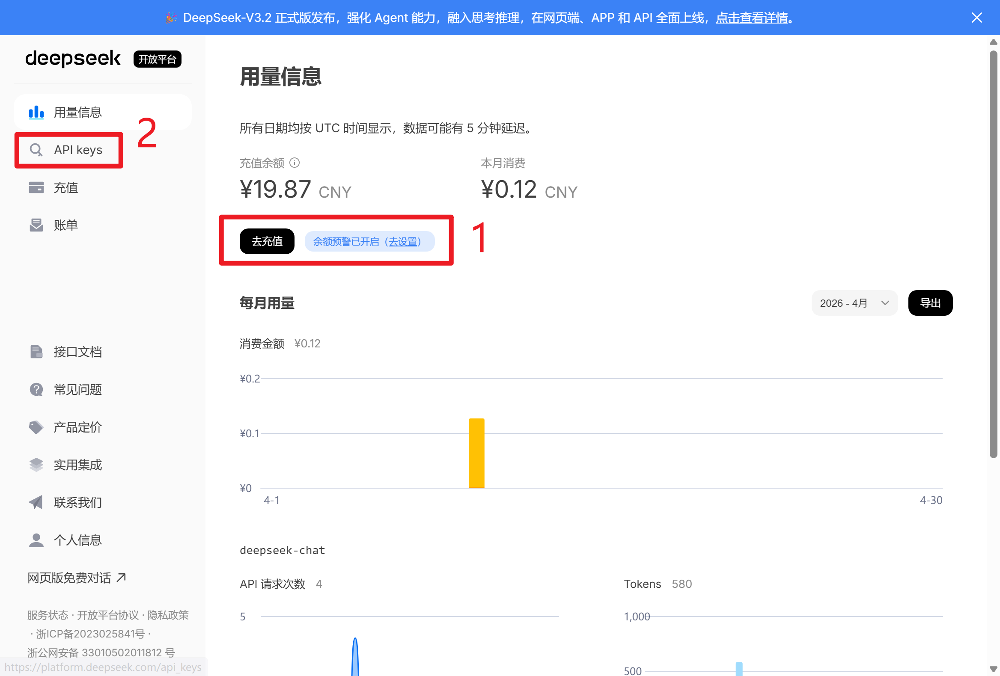
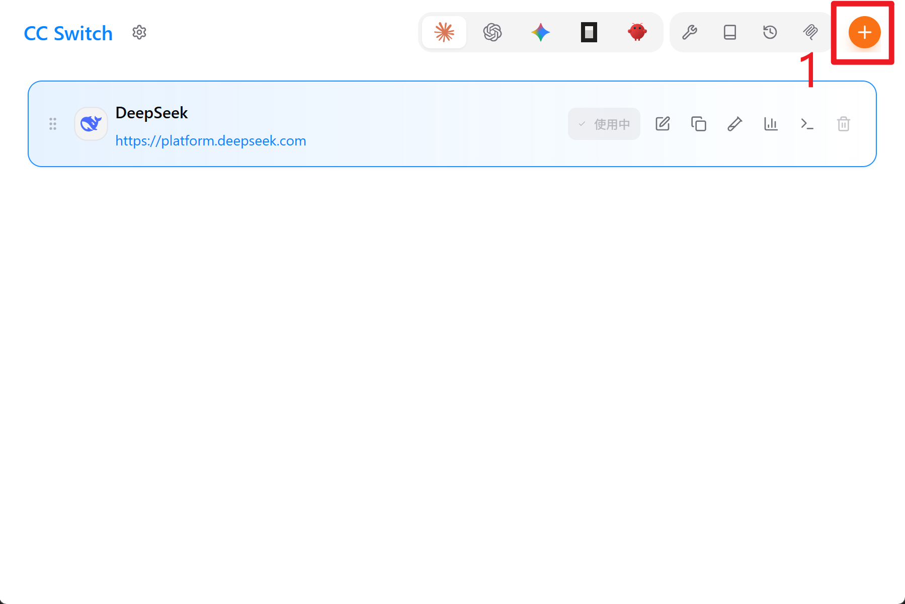
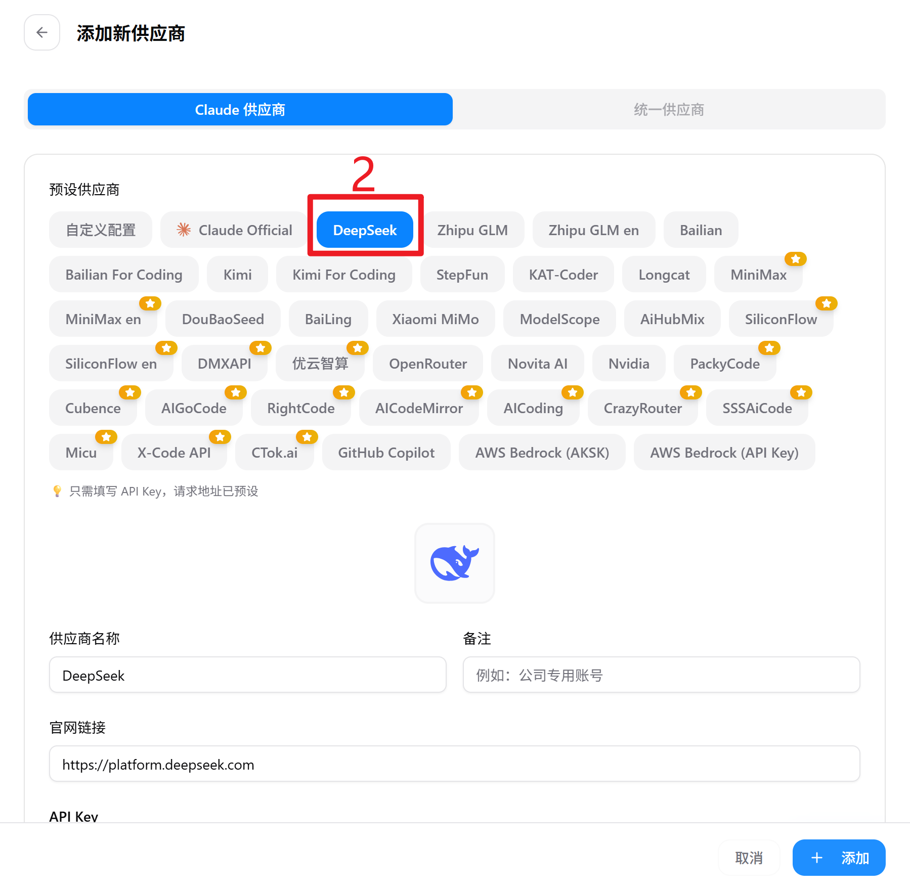
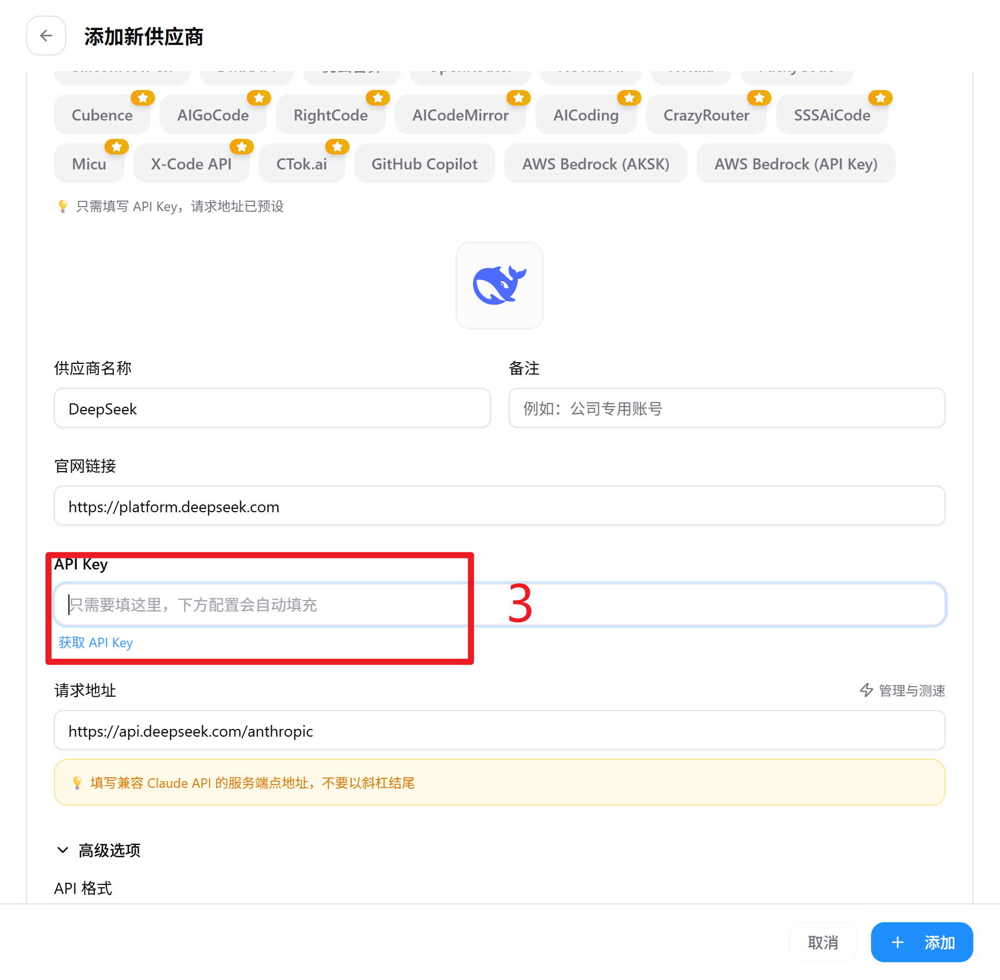
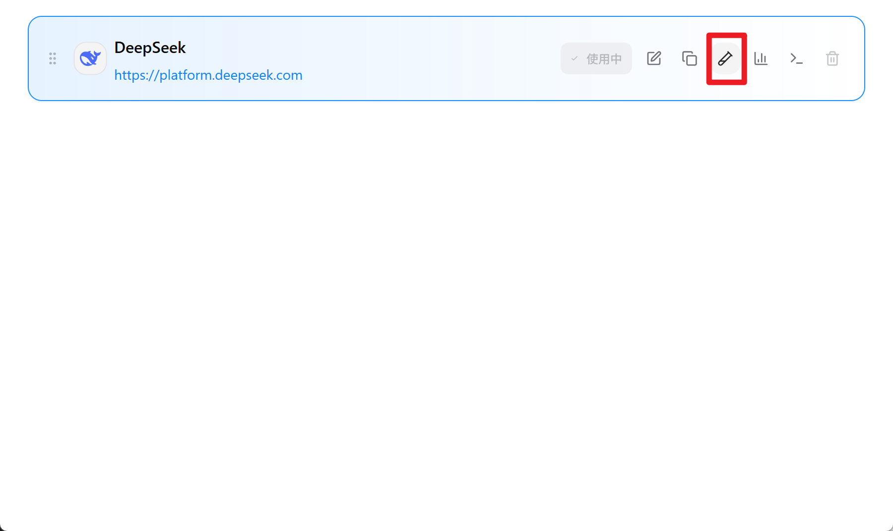
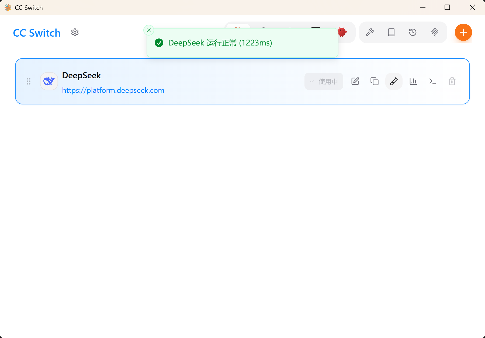
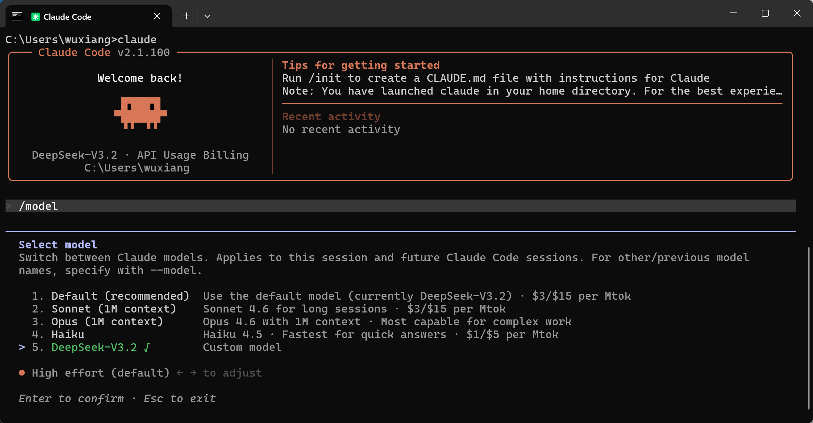
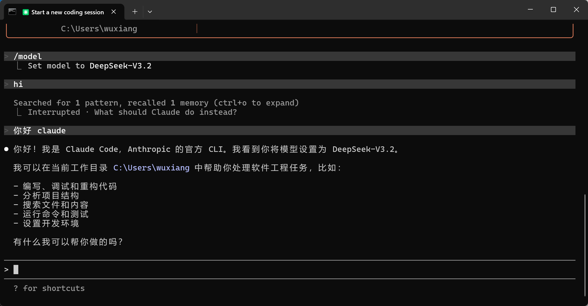

# windows部署claude并接入国产大模型DeepSeek
## 1. 安装nodejs
[https://nodejs.org/zh-cn/download
](https://nodejs.org/zh-cn/download)

安装后验证：
```
node -v
npm -v
```

结果：


## 2. 下载claude

启动cmd shell，输入：
```
npm install -g @anthropic-ai/claude-code
```

验证：
```
claude --version
```

结果：


## 3. 安装git
自行配置git、github or gitee

## 4. 购买DeepSeek API


复制API key，下一步使用。

## 5. 下载cc-switch
[https://github.com/farion1231/cc-switch/releases/tag/v3.12.2](https://github.com/farion1231/cc-switch/releases/tag/v3.12.2)







填入上一步购买的API key，然后添加。

测试模型：



## 6. Claude code中使用DeepSeek大模型



